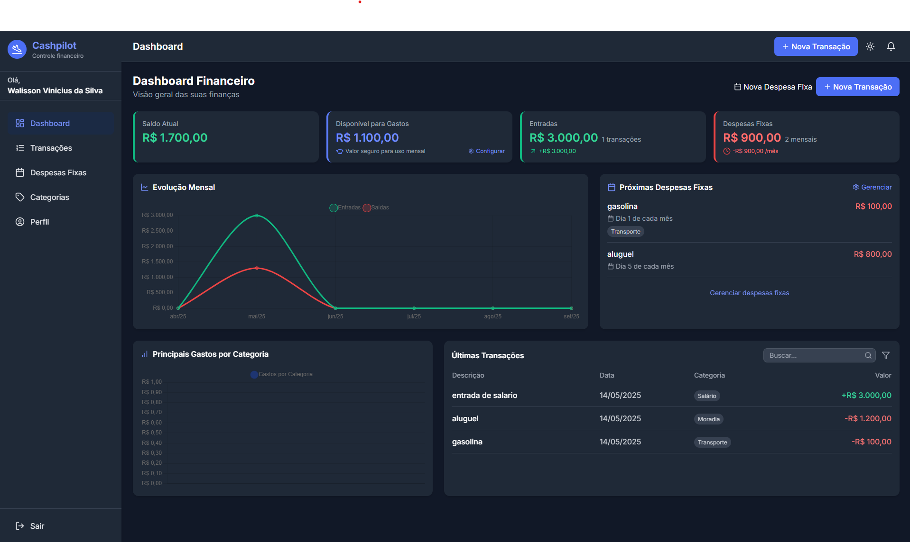

# 💸 CashPilot



Aplicativo de **finanças pessoais** focado em simplicidade: registre **entradas/saídas**, categorize transações e acompanhe o **saldo**.

🔗 **Live/Demo:** veja o link em **About → Website** do repositório

🧰 **Stack:** Vite (React) · TypeScript · Tailwind CSS · Supabase (auth & DB)

---

## ✨ Recursos
- ➕ Cadastro de **transações** (receitas/despesas)
- 🏷️ **Categorias** básicas
- 🧮 Visão de **saldo** e totalizações
- 🔐 **Autenticação** e persistência com **Supabase**

## 🚀 Como rodar localmente
Requisitos: **Node 18+** e **npm**

```bash
npm install
npm run dev
# http://localhost:5173 (padrão do Vite)

```

### 🔐 Variáveis de ambiente (Supabase)

Crie um arquivo `.env` na raiz:

```bash
VITE_SUPABASE_URL=...
VITE_SUPABASE_ANON_KEY=...

```

## 🛠️ Scripts

- `dev` – desenvolvimento
- `build` – build de produção
- `preview` – pré-visualizar o build

## ☁️ Deploy

- **Vercel** / **Netlify** / qualquer host de SPA.
- Não esqueça de configurar `VITE_SUPABASE_URL` e `VITE_SUPABASE_ANON_KEY`.

## 📄 Licença

MIT — veja `LICENSE`.

## 🤝 Contribuindo

1. Fork
2. Branch: `feat/minha-feature`
3. PR ✨
